# 📜 **Mermaid 模板库**

## 1. 技术架构图（横向流程图）

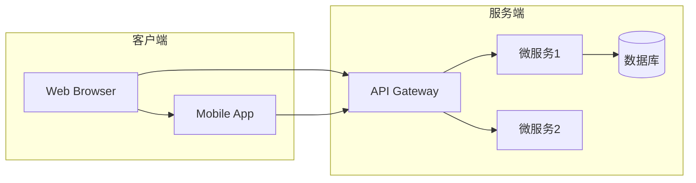

## 2. 系统部署拓扑（竖向流程图）

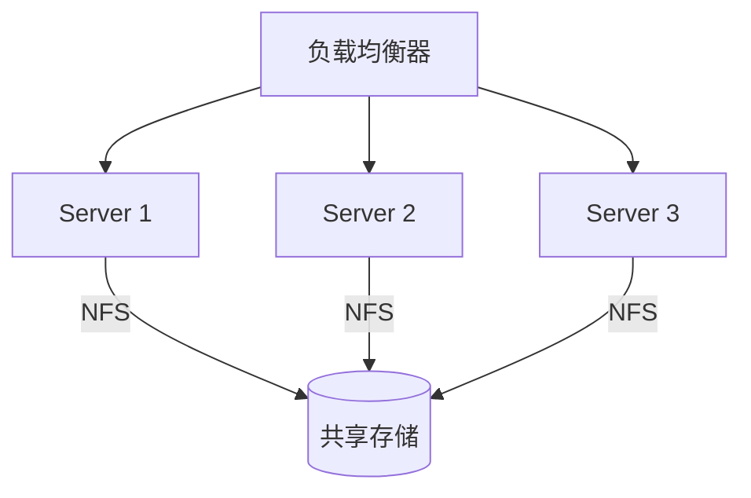

## 3. CI/CD 流水线（横向时序）

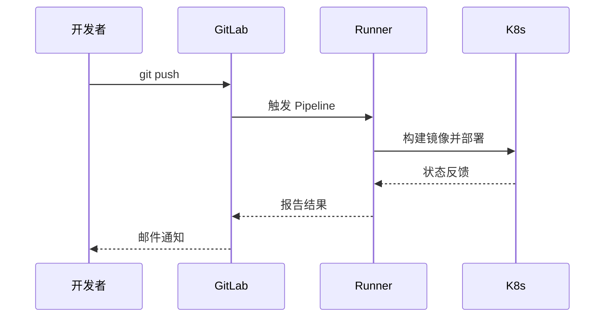

## 4. 数据库关系图（ER 图）

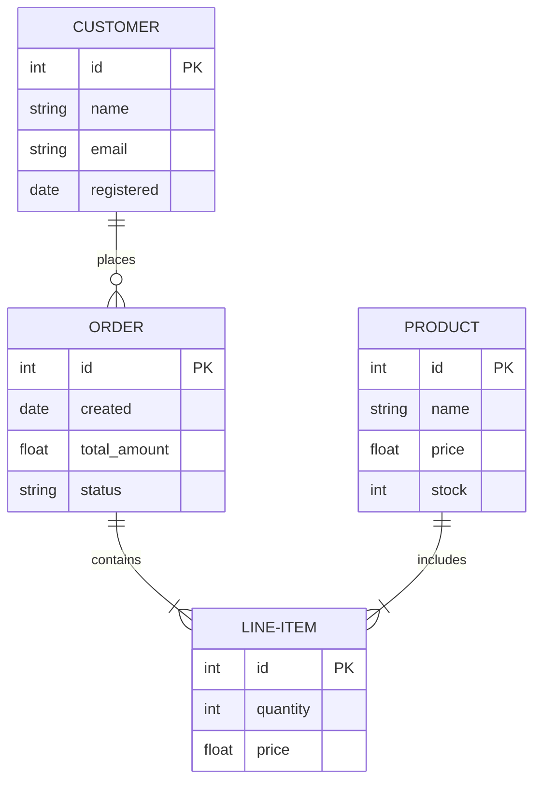

## 5. Kubernetes Pod 生命周期

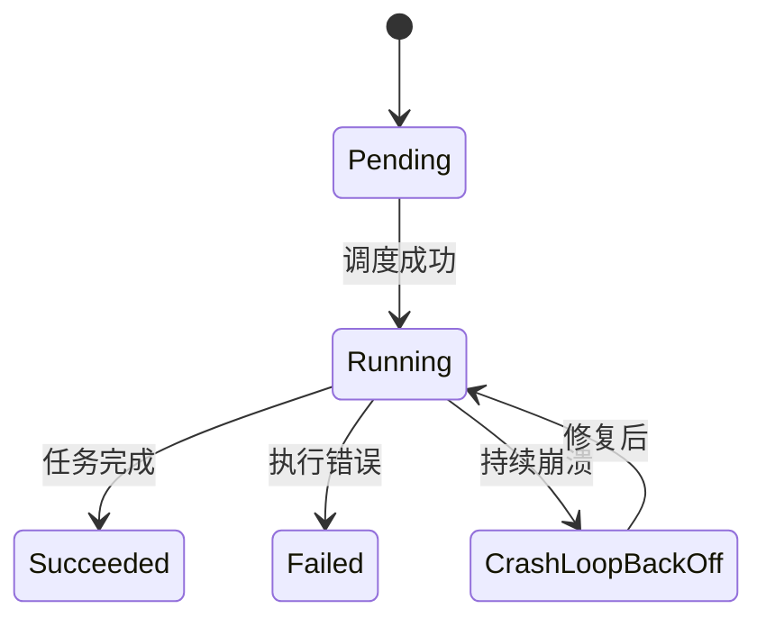

## 6. 网络协议栈对比（横向对比图）

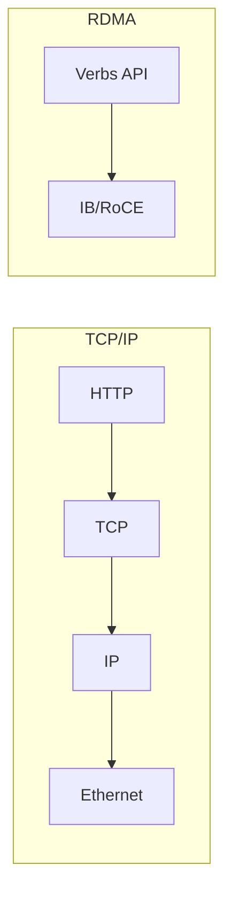

## 7. 监控告警流程（甘特图）

```mermaid
gantt
    title 告警响应时间线
    dateFormat  HH:mm
    section 故障发现
    Prometheus 检测       :a1, 09:00, 2m
    section 告警处理
    发送邮件通知         :a2, after a1, 5m
    运维人员响应        :a3, after a2, 15m
    section 恢复验证
    服务自愈           :a4, after a3, 10m
```

## 8. 用户权限体系（类图）

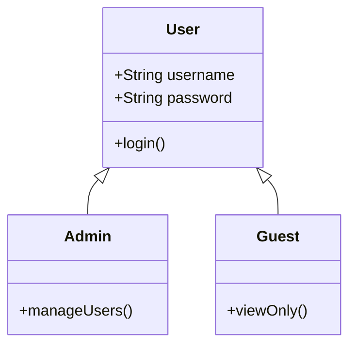

## 9. 决策树（横向流程图）

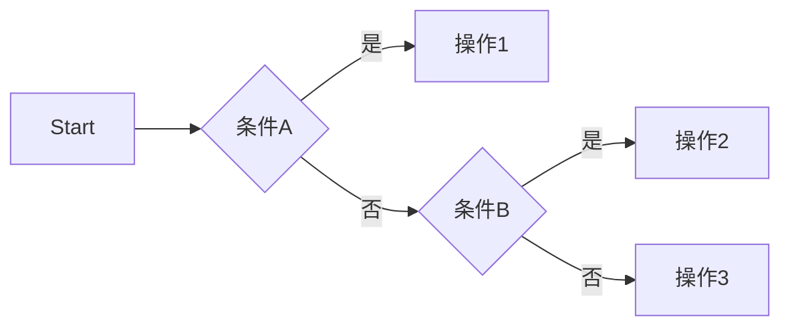

## 10. 服务器状态统计（饼图）

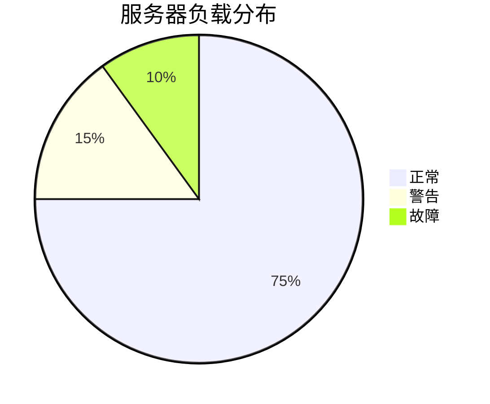

## 11. 用户交互流程（顺序图）

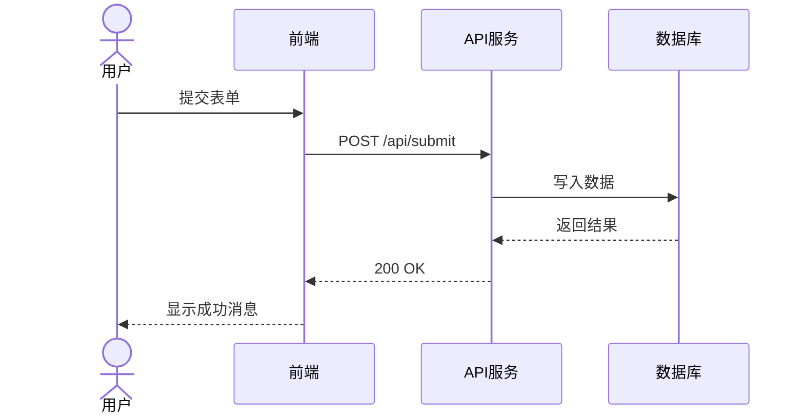

## 12. 项目里程碑（时间线）

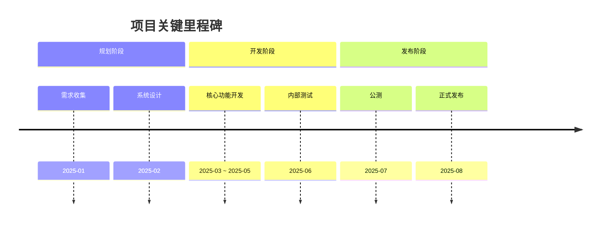

## 13. 业务流程图（泳道图）

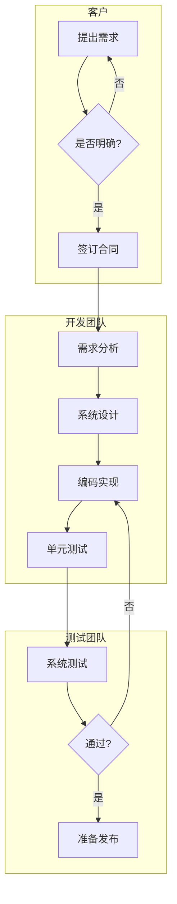

## 14. 项目优先级矩阵

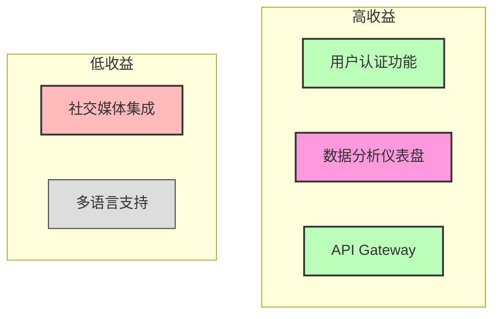

## 15. 思维导图

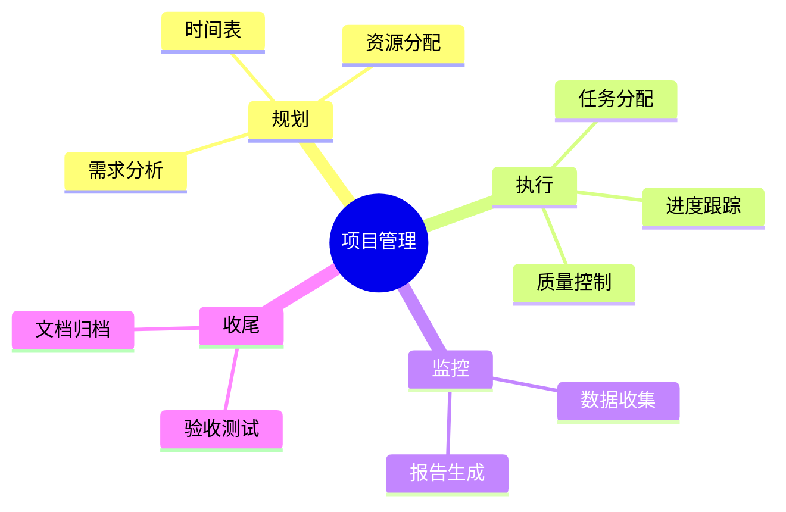

## 16. 组织架构图

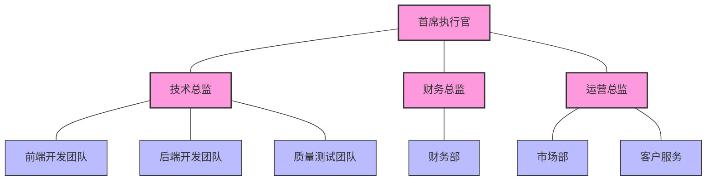

## 17. 组合图表（混合使用多种图表）

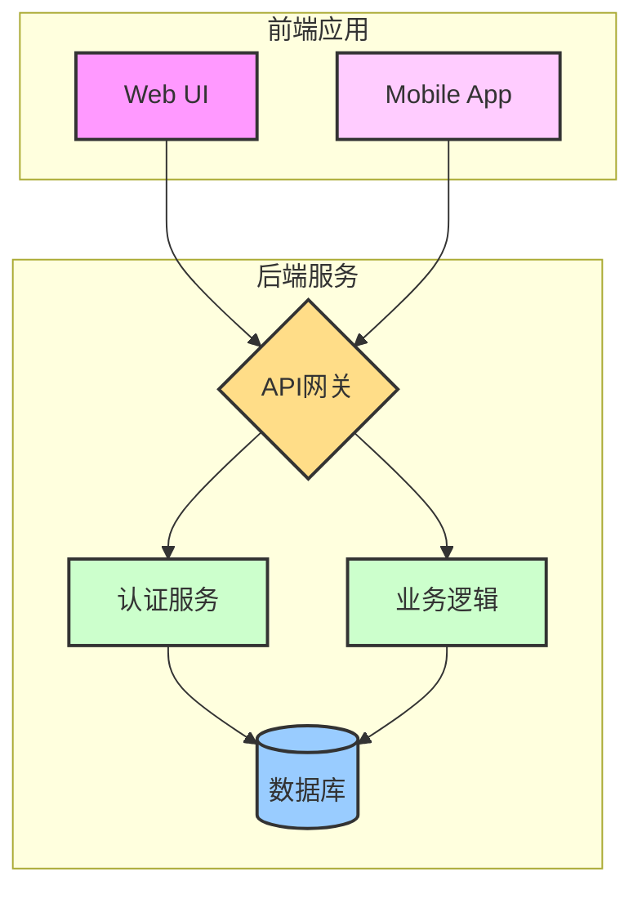

## 18. 主题配置与样式美化

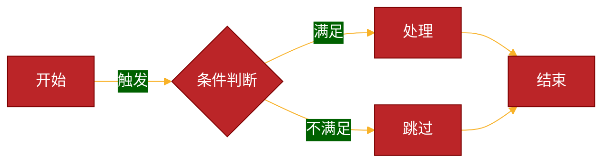

## 19. Git分支管理流程

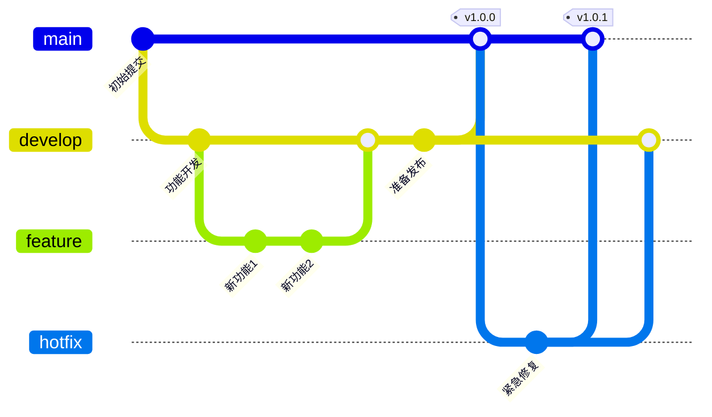

## 20. C4模型系统上下文图

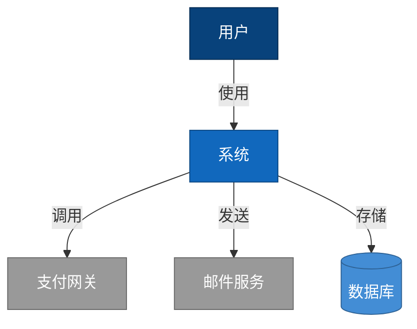

---

### 🎯 **使用技巧**

1. **快速修改**  
   - 替换 `[]` 中的文本即可适配您的场景  
   - 调整方向：`LR`（左→右）、`TD`/`TB`（上→下）、`RL`（右→左）

2. **样式美化**  
   在图表开头添加主题配置：

   ```plaintext
   %%{init: {'theme': 'forest'}}%%
   graph LR
       A[Green Node] --> B[Blue Node]
   ```

   ```mermaid
   %%{init: {'theme': 'forest'}}%%
   graph LR
       A[Green Node] --> B[Blue Node]
   ```

   支持主题：`default`/`forest`/`dark`/`neutral`

3. **组合使用**  
   用 `subgraph` 嵌套多个图表模块，例如同时展示物理机和容器部署：

   ```plaintext
   graph TB
       subgraph 物理机
           A[Server] --> B[NFS]
       end
       subgraph Kubernetes
           C[Pod] --> D[PVC]
       end
       B --> D
   ```

   ```mermaid
   graph TB
       subgraph 物理机
           A[Server] --> B[NFS]
       end
       subgraph Kubernetes
           C[Pod] --> D[PVC]
       end
       B --> D
   ```

4. **兼容性提示**  
   - 某些高级图表类型如`quadrantChart`可能在不同渲染器中兼容性不同
   - 遇到渲染问题时，可使用标准流程图配合样式实现类似效果

---

### 📂 **模板保存建议**

1. 创建 mermaid_templates.md 文件存放这些模板  
2. 在 VS Code 中安装 **Mermaid Preview** 插件实时调试  
3. 团队共享时，推荐用 GitLab/GitHub 的 Markdown 渲染能力
